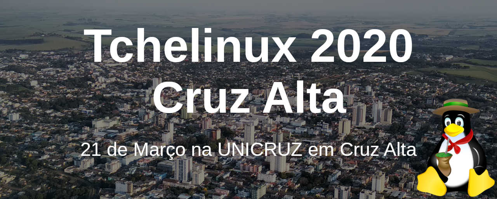

## Sobre

O grupo de usuários de Software Livre Tchelinux, em parceria com a [**Universidade de Cruz Alta**](https://home.unicruz.edu.br/), tem o prazer de convidar a comunidade para participar do evento que ocorrerá no dia **21 de Março** no Salão Nobre da UNICRUZ (Rodovia Municipal Jacob Della Mea, s/n km 5,6 - Parada Benito, Cruz Alta).

## Chamada de Trabalhos

A **Chamada de Trabalhos está aberta** e o prazo para submissão de propostas de palestra é **23 de Fevereiro de 2020**. Os trabalhos escolhidos serão anúnciados no dia 24 de Fevereiro de 2020.

<a href="https://cruzalta.tchelinux.org/cfp/" style="color:#ff4040"><b><h3>Clique aqui e submeta sua palestra!<h3></b></a>

## Inscrições

As inscrições já se encontram abertas e podem ser feitas através do link abaixo: 

<a href="https://cruzalta.tchelinux.org/inscricoes/" style="color:#ff4040"><b><h3>Clique aqui e faça já a sua inscrição! Vagas limitadas!<h3></b></a>

O evento tem **entrada franca**, porém os participantes são encorajados a doar 2kg de alimentos não perecíveis (exceto sal), que são doados a instituições de caridade da região. Os alimentos são recebidos no momento do credenciamento.

## Certificados

Serão fornecidos certificados digitais para os participantes que confirmaram sua presença no evento. Para obtê-los, você deverá informar o email usado na sua inscrição no [sistema de certificados](https://certificados.tchelinux.org/) após a realização do evento.

**Importante:** Não esqueça de confirmar sua presença no credenciamento.

## Local

> **Universidade de Cruz Alta**
> Rodovia Municipal Jacob Della Mea, s/n Km 5.6
> Parada Benito, Cruz Alta - RS 

  <iframe src="https://www.google.com/maps/embed?pb=!1m14!1m8!1m3!1d112042.9493476923!2d-53.64822713869071!3d-28.649471741287805!3m2!1i1024!2i768!4f13.1!3m3!1m2!1s0x0%3A0x765c76ad46e7db53!2sUniversity%20of%20Cruz%20Alta!5e0!3m2!1sen!2sbr!4v1581386889289!5m2!1sen!2sbr" width="800" height="600" frameborder="0" style="border:0;" allowfullscreen=""></iframe>

## Apoio

### Institucional

### Patrocínio

### Divulgação

